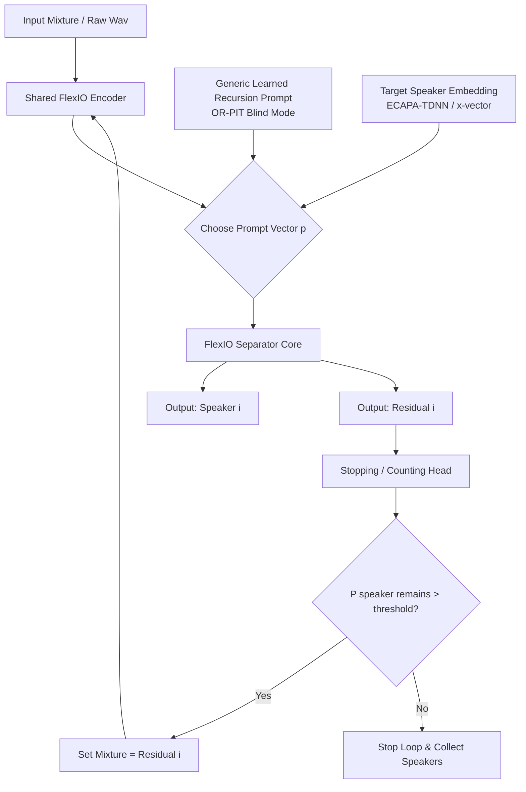

# FlexIO + OR-PIT Recursive Wrapper + Speaker-Embedding Conditioning

A modular, recursive deep learning pipeline designed for blind multi-speaker source separation, target speaker extraction, and continuous speech resolution in overlapping/noisy/reverberant environments.

---

## 1. Architectural Overview

The system layers three components on top of each other:
1. **FlexIO Core:** An array-agnostic channel-communication engine working on 1–N mics using a prompt-conditioned processing backbone.
2. **OR-PIT Recursion Wrapper:** An iterative extraction loop that pulls one speaker at a time and feeds the remaining residual back into the model, avoiding combinatorial Permutation Invariant Training ($N!$) complexity.
3. **Stopping Head + Speaker Embeddings:** A post-separation classifier that determines recursion depth (speaker count $N$) dynamically at runtime, coupled with speaker-embedding routing for targeted extraction.



---

## 2. Core Novelty Points

*   **Recursive OR-PIT Wrapper:** Reformulates separation into an iterative single-speaker-plus-residual loop, letting a single model scale to arbitrary, unseen speaker counts.
*   **Post-Separation Residual Classifier:** Predicts remaining speaker presence on post-separated residuals to determine recursion depth, bypassing error-prone pre-classification networks.
*   **Dual-Prompt Gating Core:** Merges blind recursive separation and target extraction into a single model by dynamically switching between generic and d-vector prompts.
*   **Acoustic Self-Enrolling Anchors:** Extracts speaker profiles on-the-fly from initial recursive outputs, eliminating the need for pre-enrolled target reference clips.
*   **Embedding-Guided Cross-Chunk Stitching:** Reuses speaker separation embeddings to align speaker streams across sliding windows, replacing brittle cross-correlation and OSD networks.

---

## 3. Directory Structure

```
speech separation/
├── raw/                      # Raw downloaded zip/tar archives
├── cache/
│   ├── clean_sources/        # Silence-trimmed, 16kHz mono WAV speech clips
│   ├── noise_bank/           # Normalised SLR28 point-source noises
│   └── rir_bank/             # Energy-normalised room impulse responses
├── metadata/
│   ├── speaker_splits.json   # Disjoint train/val/test speaker allocations
│   ├── source_index.json     # File index (duration, speaker_id, split)
│   └── eval_sets/            # Pre-rendered static evaluation mixtures (2 to 5 mix)
├── scripts/
│   ├── download_data.py      # Automated database downloader (rate-limited)
│   ├── prepare_data.py       # Preprocessor with on-the-fly zip/FLAC deletion
│   ├── dynamic_mixer.py      # Dynamic on-the-fly mixer (curriculum-aware)
│   ├── dataset.py            # PyTorch Dataset/DataLoader (Kaggle auto-resolver)
│   ├── build_eval_sets.py    # Pre-renders reproducible validation/test sets
│   └── verify_dataset.py     # Verification tests (sum conservation, normalization)
├── outputs/                  # Separated audio outputs from inference runs
├── inference.py              # Overlap-add sliding window inference script
└── README.md                 # This documentation
```

---

## 4. Getting Started & Setup

### Install Dependencies
Ensure you have the required audio and deep learning libraries:
```bash
pip install torch torchaudio soundfile librosa pyroomacoustics
```

### Option A: Pipeline Execution (Local or Kaggle CPU Preprocessing)
To construct the preprocessed database from scratch, run the scripts in sequence:

1. **Download Raw Audio Assets:**
   Downloads LibriSpeech clean subsets and SLR28 RIRs & noises.
   ```bash
   python scripts/download_data.py
   ```
2. **Extract & Preprocess:**
   Trims silences, resamples to 16kHz mono, and manages active storage via split-by-split deletion to run successfully under Kaggle's 20 GB disk limits.
   ```bash
   python scripts/prepare_data.py
   ```
3. **Pre-render Evaluation Sets:**
   Creates static 2, 3, 4, and 5-speaker validation/test sets for benchmark consistency.
   ```bash
   python scripts/build_eval_sets.py
   ```
4. **Run Verification Suite:**
   Runs verification tests ensuring speaker disjointness, amplitude scaling, and perfect mathematical sum-conservation.
   ```bash
   python scripts/verify_dataset.py
   ```

---

## 5. Integrating with PyTorch Training

Import and instantiate the custom dataloader in your training loop:
```python
from scripts.dataset import get_dataloader

# Step counter used for the curriculum scheduler
global_step = 0
def get_step():
    return global_step

train_loader = get_dataloader(
    metadata_dir="./metadata",
    cache_dir="./cache",
    split="train-clean-100",
    chunk_len_sec=4.0,
    batch_size=8,
    num_workers=4,
    step_getter=get_step, # Curriculum scales from 2-mix clean to 6-mix noisy+reverb
    shuffle=True
)

for epoch in range(num_epochs):
    for mixtures, sources, noises, recursion_labels in train_loader:
        # mixtures: [B, 1, L] (mixture tensor)
        # sources: List of lists containing convolved speaker targets
        # recursion_labels: List of lists containing boolean stopping targets
        
        # ... Run OR-PIT training logic ...
        global_step += 1
```

---

## 6. Running Inference

To separate speakers from an overlapping mixture file using the overlap-add sliding window:
```bash
python inference.py --input_wav path/to/mixture.wav --output_dir ./outputs --sample_rate 16000
```
This runs the overlap-add window (using a Hanning window crossfade for smooth transitions) and outputs `speaker_1.wav`, `speaker_2.wav`, etc., to the output folder.
